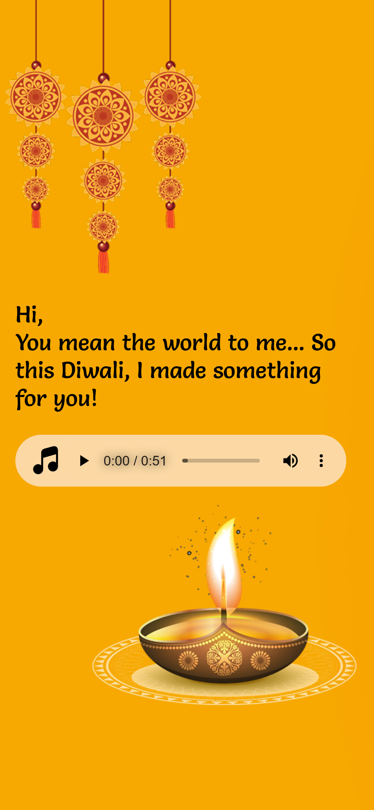

# 🎆 Diwali Wishes Web Page

A vibrant, customizable Diwali greeting webpage built with **HTML**, **CSS**, and **JavaScript**. Share festive joy with loved ones through personalized messages, stunning visuals, and traditional music.

---

## ✨ Features

- 🪔 Personalized greetings via URL query parameters (`?to=Name&from=Name`)
- 🌅 Festive imagery of Deepak, Lakshmi Maa, and Ganesh Ji
- 🎶 Traditional Indian background music with play/pause controls
- 📱 Responsive design for desktop and mobile
- 🎨 Styled with Google Fonts and custom assets

---

## 📸 Demo

👉 **[Live Demo](https://sudhanshuverse.github.io/diwali-wishes/)**  

---

## 🖼️ Screenshots

### 💻 Desktop View


### 📱 Mobile View


> Place your actual screenshots inside the `screenshots/` folder and rename them accordingly.

---

## 🚀 Getting Started

### 📥 Clone the Repo

```bash
git clone https://github.com/your-username/diwali-wishes-page.git
cd diwali-wishes-page
```


## 📂 Project Structure
```
diwali-wishes-page/
├── assets/         # Diwali images (Deepak, Lakshmi, Ganesh, etc.)
├── icons/          # Music control icons
├── music/          # Background audio
├── screenshots/    # Images for README.md
├── index.html      # Main HTML file
├── style.css       # All styles
├── script.js       # JavaScript logic (if separated)
├── favicon.ico     # Tab icon
└── README.md       # You're here!
```


## 👨‍💻 Author

Sudhanshu Kumar

Made with 💙 for Diwali

📧 Email | GitHub
